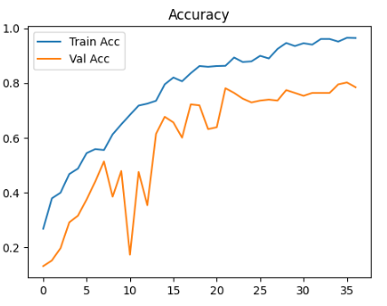
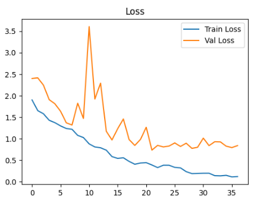
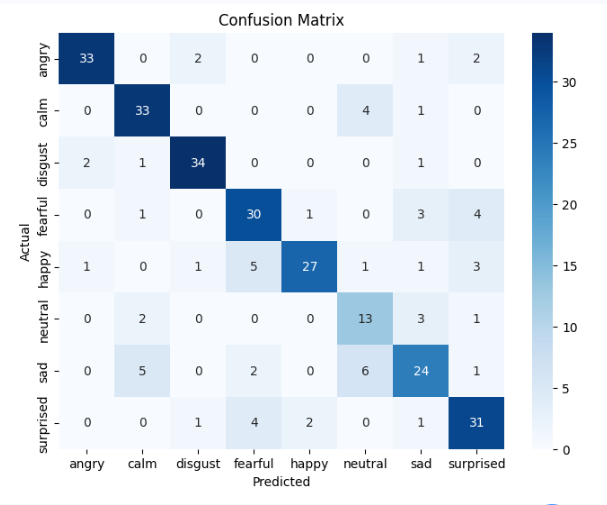

# 🎙️ Speech Emotion Recognition using CNN-LSTM

> Transforming human speech into emotions using Deep Learning and Audio Signal Processing.


---

## 📌 Project Overview

Human emotions play a crucial role in communication. This project focuses on automatically recognizing emotions from speech audio using a hybrid **CNN-LSTM Deep Learning architecture**.

The model analyzes voice recordings and classifies them into one of eight emotional categories:

✅ Neutral
✅ Calm
✅ Happy
✅ Sad
✅ Angry
✅ Fearful
✅ Disgust
✅ Surprised

This project demonstrates the application of:

* Audio Signal Processing
* Feature Engineering
* Deep Learning
* Speech Analytics
* Emotion AI

---

## 🎯 Business Use Cases

Emotion Recognition can be used in:

* 🎧 Customer Call Analysis
* 🤖 Conversational AI & Chatbots
* 📞 Call Center Monitoring
* 🧠 Mental Health Assessment
* 🎓 Smart Learning Systems
* 🚗 Voice Assistants
* 🎮 Interactive Gaming

---

## 📂 Dataset

### RAVDESS Dataset

**RAVDESS (Ryerson Audio-Visual Database of Emotional Speech and Song)** is one of the most widely used datasets for speech emotion recognition research.

Dataset contains professionally recorded emotional speech samples from multiple actors.

### Emotions Included

| Emotion   | Code |
| --------- | ---- |
| Neutral   | 01   |
| Calm      | 02   |
| Happy     | 03   |
| Sad       | 04   |
| Angry     | 05   |
| Fearful   | 06   |
| Disgust   | 07   |
| Surprised | 08   |

---

## ⚙️ Feature Engineering

The following audio features were extracted using Librosa:

### 🎵 MFCC

Mel Frequency Cepstral Coefficients capture the timbral characteristics of speech.

### 🎼 Chroma Features

Represent tonal and harmonic content.

### 🔊 Mel Spectrogram

Provides frequency representation aligned with human auditory perception.

Combined Feature Matrix:

```text
MFCC (40)
+
Chroma (12)
+
Mel Spectrogram (20)
=
72 Features
```

---

## 🧠 Model Architecture

CNN layers extract local speech patterns while LSTM layers learn temporal dependencies in voice sequences.

```text
Audio Input
     ↓
Feature Extraction
(MFCC + Chroma + Mel)
     ↓
Conv1D
     ↓
Batch Normalization
     ↓
Max Pooling
     ↓
Conv1D
     ↓
LSTM
     ↓
LSTM
     ↓
Dense Layer
     ↓
Softmax Output
     ↓
Emotion Prediction
```

---

## 🚀 Technologies Used

* Python
* TensorFlow / Keras
* Librosa
* NumPy
* Pandas
* Matplotlib
* Seaborn
* Scikit-Learn

---

## 📊 Model Performance

### Evaluation Metrics

* Accuracy
* Precision
* Recall
* F1-Score
* Confusion Matrix

### Results

| Metric        | Score |
| ------------- | ----- |
| Test Accuracy | XX%   |
| Precision     | XX    |
| Recall        | XX    |
| F1 Score      | XX    |

> Replace XX with your actual results after training.

---

## 📈 Visualizations

### Training Accuracy



### Training Loss



### Confusion Matrix



---

## 💻 Installation

Clone the repository:

```bash
git clone https://github.com/yourusername/speech-emotion-recognition.git
```

Navigate to project directory:

```bash
cd speech-emotion-recognition
```

Install dependencies:

```bash
pip install -r requirements.txt
```

---

## ▶️ Run the Project

Open the notebook and execute all cells:

```bash
jupyter notebook
```

or

```bash
Speech_Emotion_Recognition.ipynb
```

---

## 🔮 Future Improvements

* Real-time microphone emotion detection
* Streamlit Web Application
* Transformer-based Audio Models
* Audio Data Augmentation
* Model Deployment on Cloud
* Emotion Trend Dashboard

---

## 📚 Key Skills Demonstrated

✔ Deep Learning

✔ CNN-LSTM Architecture

✔ Audio Signal Processing

✔ Feature Engineering

✔ Model Evaluation

✔ Data Visualization

✔ Python Programming

✔ Machine Learning Workflow

---

## 👩‍💻 Author

**Shilpa Tumma**

Aspiring Data Analyst | AI-ML Enthusiast 

Passionate about transforming raw data into meaningful insights through analytics and machine learning.

---

## ⭐ If you found this project interesting

Consider giving this repository a ⭐ to support the project and connect with me for collaboration opportunities.
